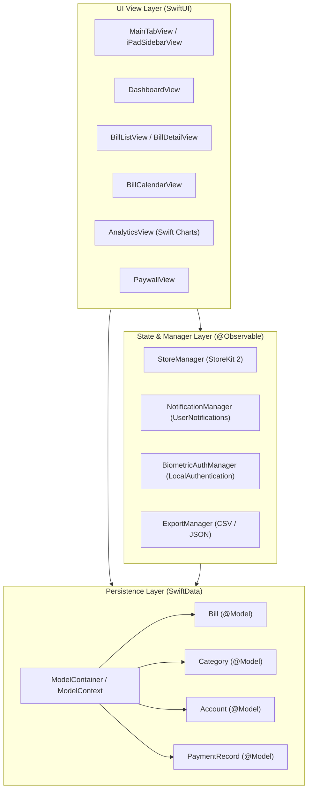
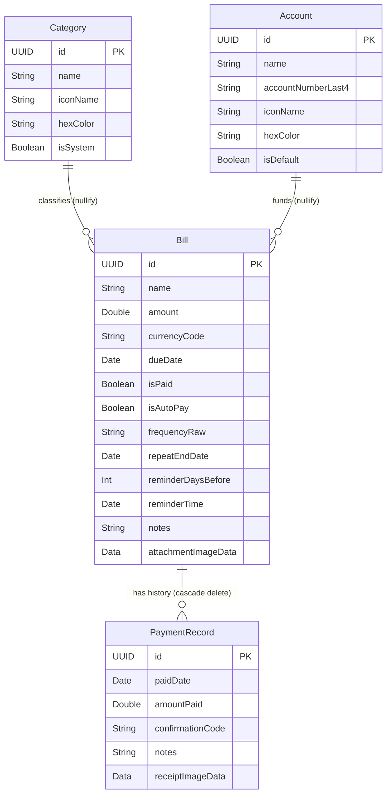
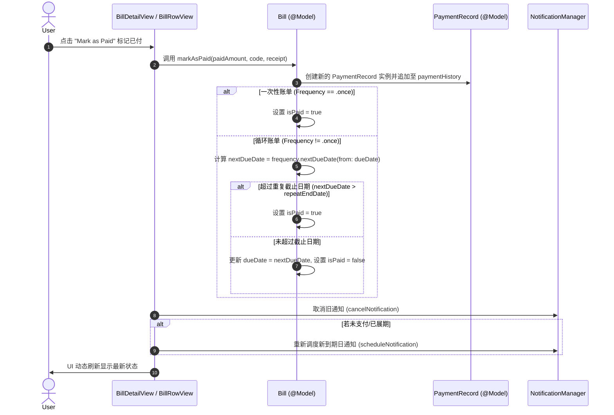
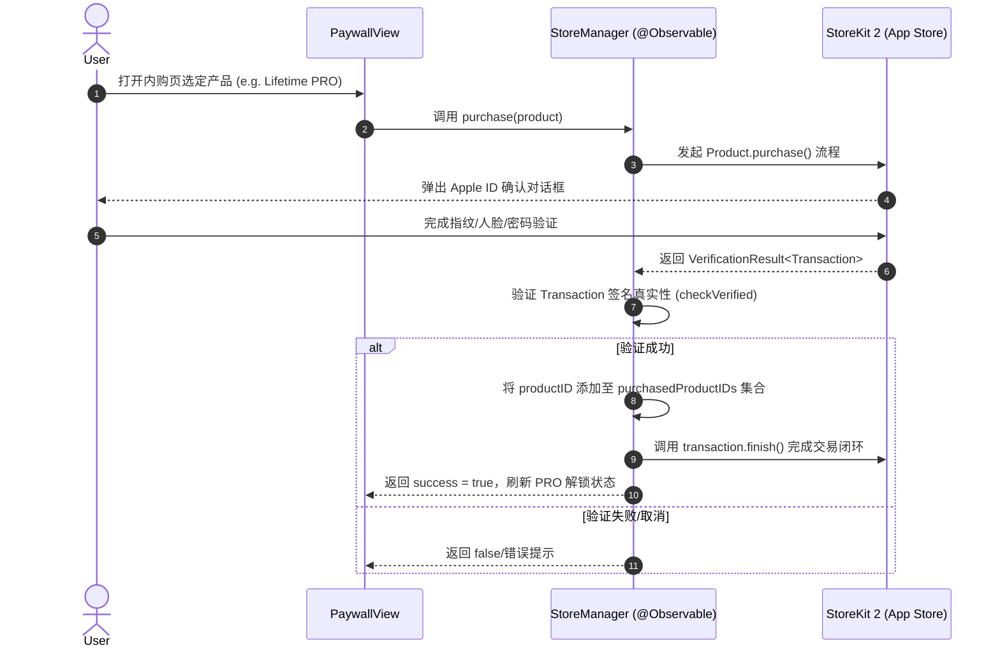

# Bills Manager - 技术架构与设计文档 (Architecture & Tech Spec)

---

## 1. 系统总体架构设计

Bills Manager 采用 **Modern SwiftUI + SwiftData + `@Observable`** 的分层解耦架构，遵循 Apple 官方推荐的声明式状态驱动设计原则：



---

## 2. 数据模型实体关系图 (Entity-Relationship Diagram)

本地持久化基于 iOS 17 **SwiftData** 框架。各实体之间的关系定义如下：



### 2.1 删除规则 (Cascade Rules)
- **Bill $\rightarrow$ PaymentRecord**：`deleteRule: .cascade`（删除账单时，自动级联删除该账单关联的所有历史支付记录）。
- **Category $\rightarrow$ Bill** 与 **Account $\rightarrow$ Bill**：`deleteRule: .nullify`（删除某个分类或账户时，关联账单的对应指针置为空，不删除账单本身）。

---

## 3. 核心业务流程序列图 (Key Sequence Workflows)

### 3.1 周期账单支付与自动展期流程 (Bill Payment & Next Due Calculation)



### 3.2 StoreKit 2 内购与权限验证流程 (IAP Lifecycle)



---

## 4. Universal 响应式布局设计 (iPhone vs. iPad)

应用采用 **Size Class 驱动** 的 Universal 布局设计：

```swift
@Environment(\.horizontalSizeClass) private var horizontalSizeClass

if horizontalSizeClass == .regular {
    // iPad 宽屏：使用 NavigationSplitView 侧边栏布局
    iPadSidebarView(selectedTab: $selectedTab)
} else {
    // iPhone 窄屏：使用标准 TabView 底部标签栏
    TabView { ... }
}
```

---

## 5. 项目模块目录对照表

| 模块目录 | 核心类/视图 | 职责说明 |
| :--- | :--- | :--- |
| `App/` | `BillsManagerApp.swift` | 应用入口、SwiftData 容器初始化与默认数据 Seed |
| `Models/` | `Bill.swift`, `Category.swift`, `Account.swift`, `PaymentRecord.swift` | SwiftData 数据实体定义及计算属性 |
| `Managers/` | `StoreManager.swift` | StoreKit 2 产品加载、购买、恢复与状态判定 |
| | `NotificationManager.swift` | `UNUserNotificationCenter` 本地推送引擎 |
| | `BiometricAuthManager.swift` | `LAContext` Face ID / Touch ID 生物识别认证 |
| | `ExportManager.swift` | CSV 格式拼装与 JSON 全量序列化 |
| `Views/Dashboard/` | `DashboardView.swift`, `MetricCardView.swift` | 财务概览卡片、逾期 Banner、即将到期列表 |
| `Views/Bills/` | `BillListView.swift`, `BillDetailView.swift`, `AddEditBillView.swift` | 账单列表搜索筛选、详情、划归已付表单 |
| `Views/Calendar/` | `BillCalendarView.swift`, `CalendarGridCell.swift` | 交互月度日历网格与指示点 |
| `Views/Analytics/` | `AnalyticsView.swift` | Swift Charts (`SectorMark`) 分类图表 |
| `Views/Settings/` | `SettingsView.swift`, `PaywallView.swift`, `PasscodeLockView.swift` | 设置页、内购 Paywall、安全解锁遮罩 |
