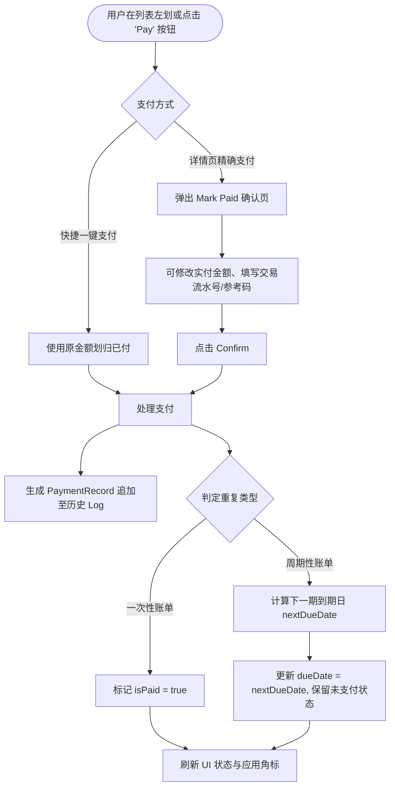

# Bills Manager - UI/UX 原型与交互流程规范 (UI/UX Spec)

---

## 1. 信息架构图 (Information Architecture)

应用采用清晰扁平的信息架构，确保用户在 2 次点击内直达任意功能模块：

```mermaid
graph TD
    AppRoot["Bills Manager App Root"]

    subgraph Nav_iPhone["iPhone 5大标签栏"]
        Tab1["Dashboard (仪表盘)"]
        Tab2["Bills (账单列表)"]
        Tab3["Calendar (交互日历)"]
        Tab4["Analytics (数据分析)"]
        Tab5["Settings (系统设置)"]
    end

    subgraph Nav_iPad["iPad 侧边栏 SplitView"]
        Sidebar["Sidebar 导航列表"]
    end

    AppRoot --> Nav_iPhone
    AppRoot --> Nav_iPad

    Tab1 --> OverdueBanner["逾期红色预警 Banner"]
    Tab1 --> MetricGrid["4大财务指标卡片"]
    Tab1 --> DueSoonList["即将到期账单列表"]

    Tab2 --> FilterBar["状态 Segmented (All/Overdue/Unpaid/Paid)"]
    Tab2 --> CatPills["分类 Capsule 筛选器"]
    Tab2 --> SearchBar["搜索框"]
    Tab2 --> BillDetail["账单详情页 (BillDetailView)"]

    Tab3 --> MonthSelector["月度切换 Header"]
    Tab3 --> Grid["7x6 状态圆点日历网格"]
    Tab3 --> DayList["选中日期账单清单"]

    Tab4 --> TimePicker["时间范围切换器 (本月/3个月/今年/全部)"]
    Tab4 --> DonutChart["Swift Charts 分类占比环形图"]

    Tab5 --> ProBanner["PRO 升级 Banner -> PaywallView"]
    Tab5 --> CatMgr["分类管理 (CategoryManagerView)"]
    Tab5 --> AccMgr["账户管理 (AccountManagerView)"]
    Tab5 --> SecLock["Face ID 生物识别开关"]
    Tab5 --> Export["CSV / JSON 导出分享"]

    BillDetail --> EditBill["新建/编辑账单 (AddEditBillView)"]
    BillDetail --> PaySheet["标记已付弹出页 (Mark Paid Sheet)"]
```



---

## 2. 核心用户交互旅程图 (User Journey Flowcharts)

### 2.1 新建账单交互流程 (Creating a Bill)

```mermaid
flowchart TD
    Start([用户点击导航栏 '+' 图标]) --> Form[弹出 AddEditBillView 模态页]
    Form --> Input1[输入账单名称与金额]
    Form --> Input2[选择到期日与重复周期 e.g. Monthly]
    Form --> Input3[分配分类与支付账户]
    Form --> Input4[可选: 设置提前提醒天数/时刻/备注/小票图片]
    Input4 --> SaveCheck{输入有效性检查}
    SaveCheck -- "名称为空或金额非法" --> DisableSave[保存按键禁态 (Disabled)]
    SaveCheck -- "有效" --> ClickSave[点击 Save 保存]
    ClickSave --> SaveDB[写入 SwiftData 数据库]
    SaveDB --> ScheduleNotif[调用 NotificationManager 设定本地推送]
    ScheduleNotif --> Dismiss[关闭模态页，列表动态刷新动画]
```

### 2.2 账单划归已付与周期展期流程 (Marking Paid Flow)



---

## 3. 页面解构与视觉规范 (Screen Layout Anatomy)

### 3.1 仪表盘页面解构 (Dashboard Layout)

```
+---------------------------------------------------+
|  [+] Dashboard                        2026-07-27  |
+---------------------------------------------------+
|  [!] Overdue Bills (2)               Total: $140  |  <- 逾期预警 Banner (浅红底红字)
+---------------------------------------------------+
|  +---------------------+  +--------------------+  |
|  | [Clock]             |  | [Exclamation]      |  |
|  | $1,625.50           |  | $140.00            |  |  <- 2x2 统计卡片网格
|  | Due This Month      |  | Overdue Amount     |  |
|  +---------------------+  +--------------------+  |
|  | [Checkmark]         |  | [Tray]             |  |
|  | $14.99              |  | 4 Active Bills     |  |
|  | Paid This Month     |  | Active Bills       |  |
|  +---------------------+  +--------------------+  |
+---------------------------------------------------+
|  Action Required Soon                             |
|  +----------------------------------------------+ |
|  | (⚡) Electricity Bill              $125.50  | |  <- 账单列表项卡片 (带分类图标与
|  |     Due in 2 days • Utilities     [ Pay ]  | |     行内快捷支付 Button)
|  +----------------------------------------------+ |
+---------------------------------------------------+
```

### 3.2 交互日历页面解构 (Calendar Layout)

```
+---------------------------------------------------+
|  [<]                  July 2026               [>] |  <- 月度切换 Header
+---------------------------------------------------+
|  SUN   MON   TUE   WED   THU   FRI   SAT          |  <- 星期 Header
|   28    29    30     1     2     3     4          |
|   5      6     7     8     9    10    11          |
|  12     13    14    15    16    17    18          |
|  19     20    21    22   (27)   24    25          |  <- 圆圈高亮选中日期；
|                      •    •••                     |     日期下方带 1~3 个状态指示圆点
|  26    (27)   28    29    30    31     1          |
+---------------------------------------------------+
|  Bills Due on July 27, 2026                       |
|  +----------------------------------------------+ |
|  | (🏠) Apartment Rent              $1,500.00  | |  <- 选中日期联动的账单清单
|  |     Due Today • Housing           [ Pay ]  | |
|  +----------------------------------------------+ |
+---------------------------------------------------+
```

---

## 4. 微交互与动画规范 (Micro-Interactions & States)

1. **划归已付动画**：
   - 点击复选框或快捷按键时，使用 `withAnimation(.spring(response: 0.3))` 触发平滑缩放与颜色渐变切换（灰色圆圈 $\rightarrow$ 绿色打勾图案）。
2. **列表 Swipe 动作**：
   - 全宽 Swipe 动作 (Full Swipe Enabled)：向右拖拽直接触发划归已付；向左拖拽拉出编辑与删除菜单。
3. **Face ID 隐私护盾遮罩**：
   - 当系统监听到 `scenePhase == .background` 时，立即渲染 `PasscodeLockView` 高斯模糊覆盖层，防止多任务后台预览界面泄露敏感财务数据。
